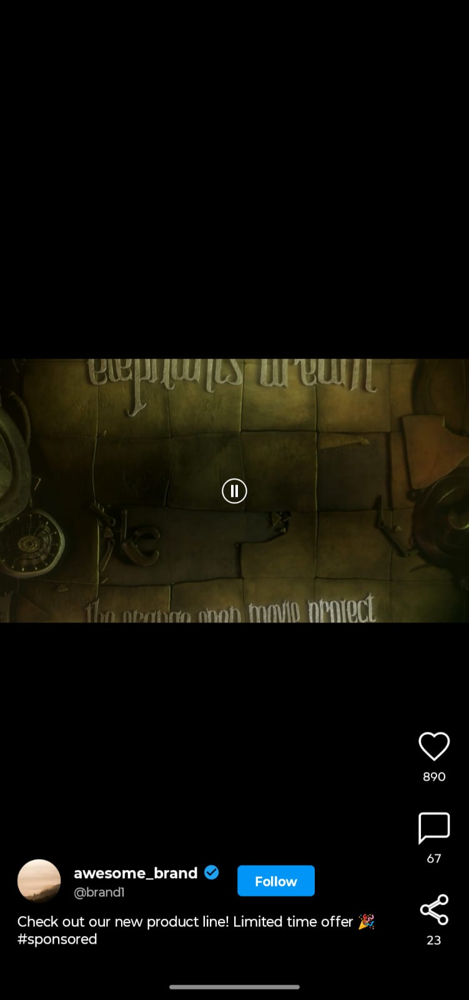
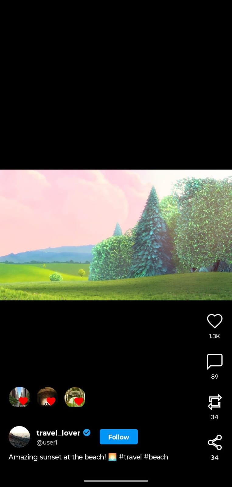
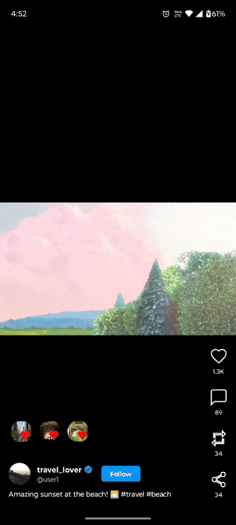

# MediaScroller Library

[](https://kotlinlang.org/)
[](LICENSE)
[](#)
[](#)

**A powerful Instagram Reels-style content scroller for Android** with vertical paging, auto-play videos, image carousels, floating avatars, and rich interaction controls.

Supports videos , single images, and multi-image carousels with smooth animations, double-tap to like, and fully customizable UI components.

---

## Preview

| Video Reels | Image Carousel | Floating Avatars |
|-------------|----------------|------------------|
|  |  |  |

### Demo Video
<div align="center">
  
</div>

---

## ✨ Features

- **Multiple Content Types** – Videos, single images, and image carousels
- **Auto-play Videos** – Automatic playback with pause/resume on scroll
- **Tap to Play/Pause** – Interactive video controls with overlay feedback
- **Double-tap to Like** – Instagram-style heart animation
- **Action Buttons** – Like, Comment, Repost (auto-hidden for ads), Share
- **Floating Avatars** – Animated liked users with heart icons
- **Image Carousels** – Horizontal swipe with dot indicators
- **Owner Info** – Profile, username, verified badge, follow button
- **Smooth Scrolling** – ViewPager2-style vertical paging
- **Highly Customizable** – 20+ configuration options
- **Production Ready** – Proper lifecycle management, memory efficient
- **ExoPlayer Integration** – Reliable video playback
- **Glide Image Loading** – Fast image loading with caching

---

## Installation

**Step 1:** Add JitPack repository to your `settings.gradle.kts`:

```kotlin
dependencyResolutionManagement {
    repositoriesMode.set(RepositoriesMode.FAIL_ON_PROJECT_REPOS)
    repositories {
        google()
        mavenCentral()
        maven { url = uri("https://jitpack.io") }
    }
}
```

**Step 2:** Add the dependency to your app's `build.gradle.kts`:

```kotlin
dependencies {
	        implementation("com.github.Excelsior-Technologies-Community:MediaScroller:1.0.0")
}
```

---

## 🚀 Quick Start

### 1. Add ReelView to Your Layout

```xml
<com.ext.media_scroller.ReelView
    android:id="@+id/reelView"
    android:layout_width="match_parent"
    android:layout_height="match_parent" />
```

### 2. Setup in Activity/Fragment

```kotlin
class MainActivity : AppCompatActivity() {
    
    private lateinit var reelView: ReelView
    
    override fun onCreate(savedInstanceState: Bundle?) {
        super.onCreate(savedInstanceState)
        setContentView(R.layout.activity_main)
        
        reelView = findViewById(R.id.reelView)
        
        // Configure
        val config = ReelConfig(
            showLikeIcon = true,
            showCommentIcon = true,
            enableDoubleTapToLike = true,
            autoPlayVideos = true
        )
        reelView.setConfig(config)
        
        // Set interaction listener
        reelView.setInteractionListener(object : ReelInteractionListenerAdapter() {
            override fun onLikeClicked(reelItem: ReelItem, position: Int) {
                // Handle like action
            }
            
            override fun onCommentClicked(reelItem: ReelItem, position: Int) {
                // Handle comment action
            }
        })
        
        // Load reels
        reelView.submitList(createReelList())
    }
    
    override fun onPause() {
        super.onPause()
        reelView.pause()
    }
    
    override fun onResume() {
        super.onResume()
        reelView.resume()
    }
    
    override fun onDestroy() {
        super.onDestroy()
        reelView.release()
    }
}
```

### 3. Create Reel Data

```kotlin
private fun createReelList(): List<ReelItem> {
    return listOf(
        // Video Reel
        VideoReelItem(
            id = "1",
            owner = ReelOwner(
                userId = "user1",
                username = "travel_lover",
                profileImageUrl = "https://example.com/profile.jpg",
                isVerified = true,
                isFollowing = false
            ),
            videoUrl = "https://example.com/video.mp4",
            caption = "Amazing sunset! 🌅",
            likes = 1250,
            comments = 89,
            shares = 34,
            likedUsers = listOf(
                LikedUser("u1", "john", "https://example.com/john.jpg"),
                LikedUser("u2", "jane", "https://example.com/jane.jpg")
            )
        ),
        
        // Single Image Reel
        ImageReelItem(
            id = "2",
            owner = ReelOwner(
                userId = "user2",
                username = "food_blogger",
                profileImageUrl = "https://example.com/profile2.jpg",
                isVerified = false
            ),
            imageUrl = "https://example.com/food.jpg",
            caption = "Delicious pasta 🍝",
            likes = 567,
            comments = 45
        ),
        
        // Carousel Reel
        CarouselReelItem(
            id = "3",
            owner = ReelOwner(
                userId = "user3",
                username = "fashion_style",
                profileImageUrl = "https://example.com/profile3.jpg",
                isVerified = true
            ),
            imageUrls = listOf(
                "https://example.com/img1.jpg",
                "https://example.com/img2.jpg",
                "https://example.com/img3.jpg"
            ),
            caption = "New collection! Swipe 👉",
            likes = 3450,
            comments = 234
        )
    )
}
```

---

## ⚙️ Configuration

Customize the library with `ReelConfig`:

```kotlin
val config = ReelConfig(
    // Action Icons
    showLikeIcon = true,
    showCommentIcon = true,
    showRepostIcon = true,
    showShareIcon = true,
    iconColor = Color.WHITE,
    iconSize = 32, // dp
    
    // Custom Icons
    likeIconRes = R.drawable.custom_like,
    likedIconRes = R.drawable.custom_liked,
    
    // Carousel Indicators
    indicatorDotSize = 8, // dp
    indicatorActiveDotSize = 10, // dp
    indicatorDotColor = Color.parseColor("#80FFFFFF"),
    indicatorActiveDotColor = Color.WHITE,
    indicatorSpacing = 8, // dp
    
    // Floating Avatars
    enableFloatingAvatars = true,
    maxFloatingAvatars = 3,
    avatarSize = 40, // dp
    avatarAnimationDuration = 2000L, // ms
    
    // Owner Info
    showOwnerInfo = true,
    showFollowButton = true,
    showVerifiedBadge = true,
    
    // Video Settings
    autoPlayVideos = true,
    loopVideos = true,
    showBuffering = true,
    
    // Interactions
    enableDoubleTapToLike = true,
    doubleTapAnimationDuration = 800L
)

reelView.setConfig(config)
```

---

## 🎭 Interaction Callbacks

Implement `ReelInteractionListener` to handle user actions:

```kotlin
reelView.setInteractionListener(object : ReelInteractionListenerAdapter() {
    
    override fun onLikeClicked(reelItem: ReelItem, position: Int) {
        // User tapped like button
        updateLikeStatus(reelItem)
    }
    
    override fun onCommentClicked(reelItem: ReelItem, position: Int) {
        // Open comments bottom sheet
        showComments(reelItem.id)
    }
    
    override fun onRepostClicked(reelItem: ReelItem, position: Int) {
        // Show repost options
        shareReel(reelItem)
    }
    
    override fun onShareClicked(reelItem: ReelItem, position: Int) {
        // Open share dialog
        shareToSocial(reelItem)
    }
    
    override fun onOwnerProfileClicked(owner: ReelOwner, position: Int) {
        // Navigate to profile
        openProfile(owner.userId)
    }
    
    override fun onFollowClicked(owner: ReelOwner, position: Int) {
        // Follow/unfollow user
        toggleFollow(owner.userId)
    }
    
    override fun onDoubleTap(reelItem: ReelItem, position: Int) {
        // Double-tap detected (already triggers like animation)
        trackDoubleTapAnalytics()
    }
    
    override fun onReelChanged(reelItem: ReelItem, position: Int) {
        // Current reel changed
        preloadNextReels(position)
        trackReelView(reelItem.id)
    }
})
```

---

## 📋 Data Models

### Video Reel

```kotlin
VideoReelItem(
    id = "unique_id",
    owner = ReelOwner(/* ... */),
    videoUrl = "https://example.com/video.mp4",
    thumbnailUrl = "https://example.com/thumb.jpg",
    caption = "Video caption",
    likes = 1000,
    comments = 50,
    shares = 25,
    isLiked = false,
    isAd = false, // Set true to hide repost button
    isMuted = false,
    likedUsers = listOf(/* ... */)
)
```

### Single Image Reel

```kotlin
ImageReelItem(
    id = "unique_id",
    owner = ReelOwner(/* ... */),
    imageUrl = "https://example.com/image.jpg",
    caption = "Image caption",
    likes = 500,
    comments = 30,
    shares = 10
)
```

### Carousel Reel

```kotlin
CarouselReelItem(
    id = "unique_id",
    owner = ReelOwner(/* ... */),
    imageUrls = listOf(
        "https://example.com/img1.jpg",
        "https://example.com/img2.jpg",
        "https://example.com/img3.jpg"
    ),
    caption = "Swipe to see more",
    likes = 2000,
    comments = 150
)
```

### Owner Info

```kotlin
ReelOwner(
    userId = "user_123",
    username = "john_doe",
    profileImageUrl = "https://example.com/profile.jpg",
    isVerified = true,
    isFollowing = false
)
```

### Liked User (for Floating Avatars)

```kotlin
LikedUser(
    userId = "user_456",
    username = "jane_smith",
    profileImageUrl = "https://example.com/jane.jpg"
)
```

---

## 🎨 Customization Examples

### Custom Icons

```kotlin
val config = ReelConfig(
    likeIconRes = R.drawable.my_like_icon,
    likedIconRes = R.drawable.my_liked_icon,
    commentIconRes = R.drawable.my_comment_icon,
    shareIconRes = R.drawable.my_share_icon,
    iconColor = Color.parseColor("#E91E63")
)
```

### Hide Specific Actions

```kotlin
val config = ReelConfig(
    showRepostIcon = false, // Hide repost
    showShareIcon = false   // Hide share
)
```

### Disable Features

```kotlin
val config = ReelConfig(
    enableDoubleTapToLike = false,
    enableFloatingAvatars = false,
    showFollowButton = false
)
```

### Ad Video (No Repost Button)

```kotlin
VideoReelItem(
    id = "ad_1",
    isAd = true, // Automatically hides repost button
    // ... other properties
)
```

---

## 📱 API Reference

### ReelView Methods

| Method | Description |
|--------|-------------|
| `setConfig(config: ReelConfig)` | Apply configuration |
| `setInteractionListener(listener)` | Set interaction callbacks |
| `submitList(reels: List<ReelItem>)` | Load reel items |
| `scrollToPosition(position: Int, smooth: Boolean)` | Navigate to position |
| `getCurrentPosition(): Int` | Get current reel position |
| `pause()` | Pause current video |
| `resume()` | Resume current video |
| `release()` | Release resources (call in onDestroy) |

---

## 🔧 Requirements

- **Min SDK:** 21 (Android 5.0 Lollipop)
- **Target SDK:** 34 (Android 14)
- **Kotlin:** 1.9+
- **AndroidX:** Required

### Dependencies

The library uses:
- ExoPlayer 2.19.1 (video playback)
- Glide 4.16.0 (image loading)
- ViewPager2 (carousels)
- RecyclerView (main list)
- Coroutines (async operations)

---

## 🐛 Troubleshooting

### Videos not playing

Ensure internet permission in `AndroidManifest.xml`:

```xml
<uses-permission android:name="android.permission.INTERNET" />
```

### Images not loading

Check network connectivity and valid URLs.

### Scroll not smooth

Enable hardware acceleration in `AndroidManifest.xml`:

```xml
<application
    android:hardwareAccelerated="true">
```

### Memory leaks

Always call `release()` in `onDestroy()`:

```kotlin
override fun onDestroy() {
    super.onDestroy()
    reelView.release()
}
```

---

## 📄 License

```
MIT License

Copyright (c) 2025 Excelsior Technologies 

Permission is hereby granted, free of charge, to any person obtaining a copy
of this software and associated documentation files (the "Software"), to deal
in the Software without restriction, including without limitation the rights
to use, copy, modify, merge, publish, distribute, sublicense, and/or sell
copies of the Software, and to permit persons to whom the Software is
furnished to do so, subject to the following conditions:

The above copyright notice and this permission notice shall be included in all
copies or substantial portions of the Software.

THE SOFTWARE IS PROVIDED "AS IS", WITHOUT WARRANTY OF ANY KIND, EXPRESS OR
IMPLIED, INCLUDING BUT NOT LIMITED TO THE WARRANTIES OF MERCHANTABILITY,
FITNESS FOR A PARTICULAR PURPOSE AND NONINFRINGEMENT. IN NO EVENT SHALL THE
AUTHORS OR COPYRIGHT HOLDERS BE LIABLE FOR ANY CLAIM, DAMAGES OR OTHER
LIABILITY, WHETHER IN AN ACTION OF CONTRACT, TORT OR OTHERWISE, ARISING FROM,
OUT OF OR IN CONNECTION WITH THE SOFTWARE OR THE USE OR OTHER DEALINGS IN THE
SOFTWARE.
```

---
